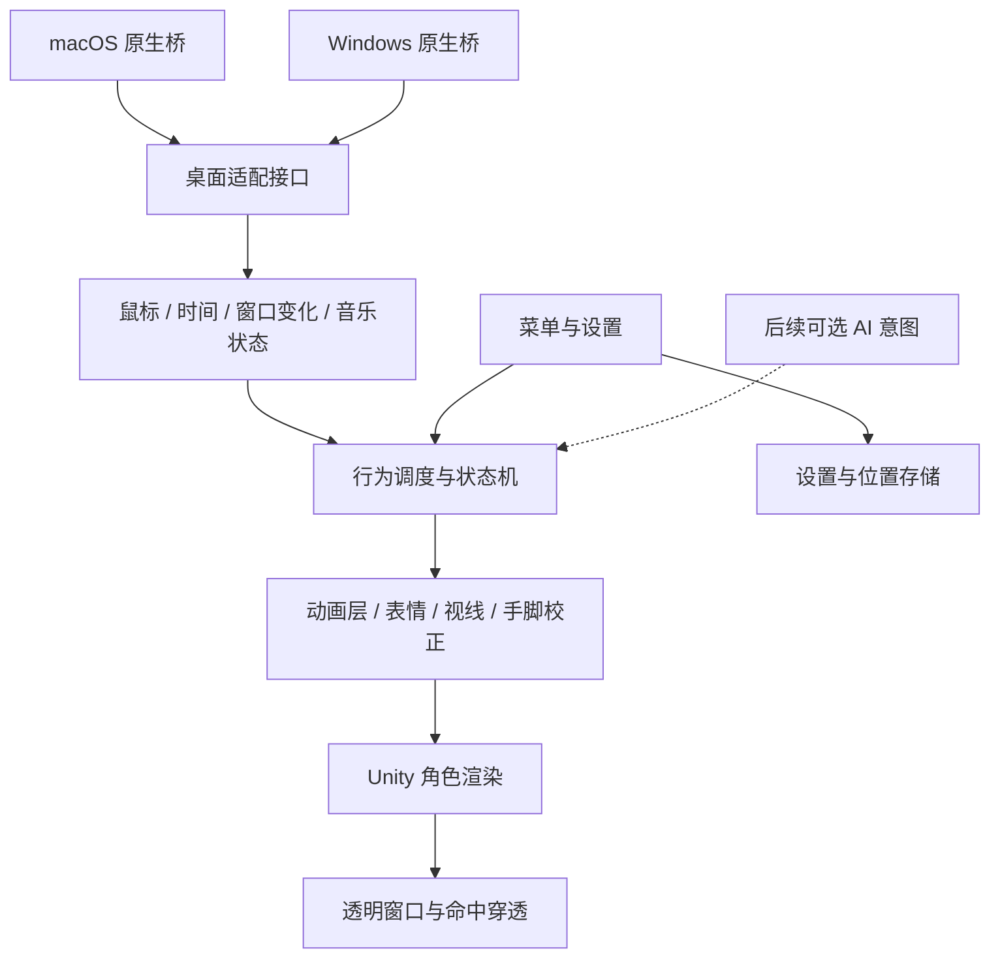

# Nookin 桌面伴侣：产品与技术方案

调研日期：2026-09-26。方向：尽量接近 MateEngine 的丰富动作与桌面互动，使用 Nookin 形象。平台暂按 macOS 优先、未来支持 Windows；用户尚未明确平台优先级与是否商业发行。

## 1. 决策摘要

**可以做，但现有 GLB 是外观资产，还不是可动画角色。** 做到拖动、整体晃动、缩放比较直接；做到自然走路、坐在窗口上、摸头反应、手追鼠标、跳舞，需要角色制作、动画系统和操作系统集成三部分共同完成。

建议产品定位为「住在桌面上的 Nookin」：先让它动作可信、对人有反应、懂得让路，再加入 AI 对话。建议技术路线为 **Unity + 自有角色与动作 + 独立的 macOS/Windows 桌面适配层**。MateEngine 作为研究参照，不直接作为默认发行底座。

建议先验证两个最可能推翻方案的假设：Nookin 的大头短肢造型能否自然完成坐下和挥手；macOS 上透明、穿透、焦点与真实窗口停靠能否同时稳定工作。当前没有开发、安装或运行这些验证。

## 2. 依据与边界

本轮完成：四张 PNG 目视检查、GLB 二进制结构检查、当前工作树检查、两个 Steam 产品页面调研、MateEngine 关键源码与许可证抽查，以及相关项目/官方文档比较。

没有完成：安装体验竞品、购买 DLC、逐帧评估宣传视频、GLB 实际渲染、模型拓扑/权重检查、Mac 原生窗口实验、性能或续航实测。下文严格区分「页面宣称」「源码发现」「本地检测」「方案建议」。价格是访问页面显示值，可能受地区、时间和折扣影响。

当前工作树只有文档与 assets，没有 package.json、src/、electron/。AGENTS.md 中 Electron 37、Three.js、Vite 7 的 MVP 记载不能视作当前已有实现，也不能因此锁定技术栈。

## 3. 产品调研

| 项目 | 一手资料可确认的方向 | 对 Nookin 的价值 | 主要边界 |
|---|---|---|---|
| Desktop Mate | 3D 角色、窗口停靠、鼠标互动、摸头、语音、闹钟；部分角色组合动作，多角色标注 beta | 学习少量高质量互动、角色性格和不打扰体验 | 素材按角色/DLC 区分；不能从宣传推出每个角色都有相同动作 |
| MateEngine | 自定义 VRM、待机/拖动、追踪、触摸区域、音乐跳舞、设置、模组与 Workshop | 最接近目标的功能与模块参照 | 资料版本冲突，Windows 集成明显；授权不适合默认直接 fork 发行 |
| VPet | 2D 桌宠、投喂、提起、爬墙、丰富状态动画与创意工坊；WPF 架构 | 学习行为状态和内容扩展 | 不适合作为 macOS 3D 产品直接底座 |
| AIRI | Live2D/VRM、对话与语音、Electron 桌面窗口；更深的智能体能力仍演进中 | 后续 AI 对话和角色表现解耦的参考 | 用户当前优先级是动作与桌面互动，不需要先承担完整 AI 平台复杂度 |

来源：[Desktop Mate 商店](https://store.steampowered.com/app/3301060/Desktop_Mate/?l=schinese)、[MateEngine 商店](https://store.steampowered.com/app/3625270/MateEngine/)、[VPet 仓库](https://github.com/LorisYounger/VPet)、[AIRI 官方概览](https://airi.moeru.ai/docs/zh-Hans/docs/overview/)。查询日期均为 2026-09-26。以上为产品/作者描述，不是本项目实测。

### 3.1 Desktop Mate：借鉴体验完成度

商店当前基础应用免费，所列若干角色 DLC 显示 $14.99。页面已有 Windows/macOS 两个平台；macOS 明确要求 Apple silicon、不支持 Intel。因此不能沿用早期资料里的「只有 Windows」。本次只确认平台列出与要求，未核验 Mac 和 Windows 各功能是否完全一致。

值得借鉴的是桌面中的连续体验：用户把它放在窗口上，它坐住；鼠标靠近时，它回应；用户工作时，它收敛。角色专属语音、成对互动可以制造个性，但不应成为首版内容负担。[来源](https://store.steampowered.com/app/3301060/Desktop_Mate/?l=schinese)

### 3.2 MateEngine：功能丰富，但必须按版本拆开判断

Steam 页面本次显示 $5.49；GitHub README 仍保留 $3.99 的历史发行说明，应以实际购买地区的商店为准。商店列出 Windows 11，注明 Windows 10 支持但未测试；GitHub 提供免费版本，Steam 版含额外内容与 Workshop 等差异。[商店](https://store.steampowered.com/app/3625270/MateEngine/)、[README](https://github.com/shinyflvre/Mate-Engine)

页面里的重要冲突：

- 窗口停靠在正文中展示，并标注实验性；同页 Known Limitations 又称窗口/任务栏坐姿被禁用以避免部分游戏反作弊问题。
- VRM 1/MToon10 在导入说明中出现，但功能列表另有「即将支持」表述。
- README 的中英日内容和功能比较表并非同一版本，不能用其自评的性能/反作弊/竞品能力结论替代独立验证。

因此，Nookin 的计划按我们自己的验收结果定义，而不是把 MateEngine 勾选表全部列成已解决事项。公开 Issue 列表中也存在角色越出屏幕、任务栏置顶、模型导入与舞蹈包冲突等报告；这些说明应该覆盖哪些测试，不说明缺陷发生率。[Issue 列表](https://github.com/shinyflvre/Mate-Engine/issues)

### 3.3 核心判断

这类产品的「活着感」来自 **动作内容 × 动作衔接 × 环境反应 × 不打扰**。单纯增加动画数量，或者接入聊天模型，都不能代替这四项。Nookin 应借鉴 MateEngine 的能力结构，并为自己的大头短肢形象专门调整动作幅度。

## 4. 现有素材能做到什么

### 4.1 PNG

四张图是同一形象的完整姿态：pet 为眨眼比手势，happy 为举手跳起，gentle 为闭眼温和姿态，thinking 为思考姿态。适合用作形象规范、表情目标、动作关键姿势与设置页插图。

它们不是连续动画帧，也不是头、眼、手、身体拆开的分层文件。直接切换会出现姿态跳变；不能通过淡入淡出就获得自然走路、转身和坐姿。2D 序列帧方案可行，但需额外制作大量连贯帧，且不是本次丰富 3D 互动的首选。

### 4.2 GLB 本地检测

文件：assets/nookin-tripo-v1.glb；glTF 2.0，generator 为 Tripo。

| 项目 | 检测结果 | 含义 |
|---|---:|---|
| 大小 | 16,436,932 字节，约 15.68 MiB | 不是运行内存占用 |
| 节点/网格/primitive | 各 1 | 未提供可独立操作的头眼四肢节点；不等于几何一定焊接成一块 |
| 顶点 | 284,228 | 对小尺寸常驻角色而言有优化空间 |
| 三角面 | 501,424 | indices / 3，primitive mode 为 TRIANGLES |
| skin | 0 | 无骨骼蒙皮 |
| animation | 0 | 无内置动作 |
| morph targets | 0 | 无表情变形目标 |
| 贴图 | 3 张 2048×2048 JPEG | basecolor、normal、metallic/roughness |

三张贴图若按 RGBA8 解码，基础纹理约 48 MiB；完整 mipmap 约 64 MiB。这只是规划量级，实际格式、压缩和加载副本会改变占用，不能据此报整机 RAM 或显存实测。

**现在可以做：** 加载模型、整体位移/旋转/缩放、整体弹跳、用外部粒子表达反应。**现在不能直接做：** 独立点头、眨眼、嘴型、抬手、弯腿、自然坐姿和复用 Humanoid 动作。可以编程人为变形，但不能当作已存在的生产级角色绑定。

### 4.3 推荐角色生产流程

1. 保留原始文件，对工作副本进行正面/侧面/背面检查，确认手与衣服是否粘连、背部是否完整、面部是否适合变形。当前结构检测无法回答这些问题。
2. 以现有图片锁定轮廓、脸部比例和材质风格。必要时重拓扑，而不只使用自动减面。
3. 制作中性 A/T 姿态、适合肘膝弯曲的拓扑、UV 与烘焙。首轮尝试 2万—5万三角面，最终依据 200—350 像素显示尺寸与性能测量决定。
4. 加人体主骨骼；帽耳、披肩可使用少量附加骨骼。眼球是否独立、表情采用形变还是材质切换，需根据模型检查决定。
5. 制作眨眼、开心、困倦、惊讶等表情，调整权重；验证坐姿腹部压缩、肩膀抬起和披肩穿模。
6. 先完成 idle、wave、sit 三个代表动作，再扩充动作库。保留 Blender 源文件、纹理、动画和导出参数。

内部角色可以先用 FBX/GLB 加配套配置；开放自定义角色时再以 VRM 1.0 为目标接口。**GLB 改后缀为 VRM 无法补出骨骼、表情或元数据。** VRM 有明确的人形骨骼与结构要求。[VRM 官方转换说明](https://vrm.dev/en/vrm/how_to_make_vrm/convert_from_humanoid_model/)、[VRM 1.0 骨骼规范](https://github.com/vrm-c/vrm-specification/blob/master/specification/VRMC_vrm-1.0/humanoid.md)

现有模型若拓扑质量不足，应把它用作外观参考和烘焙来源，重做可动画的轻量版本。是否需要重做，当前尚无足够证据。

## 5. 产品方案

### 5.1 目标体验

Nookin 是可摸、可提起、会观察鼠标、会找地方休息的小伙伴。默认安静常驻；用户靠近时有反应；离开一段时间后自然休息。首版单角色、本地运行，不要求账户或网络。

一个完整使用场景：启动后出现在上次位置，轻轻挥手；用户摸头，它眯眼抬头；拖动时进入被提起姿态；放到浏览器上边缘时坐下，腿悬在窗口前方；窗口移动，它跟着移动；窗口最小化，它回到屏幕底部安全位置。未开启窗口互动或权限不可用时，仍可正常站立、拖动与屏幕边缘休息。

### 5.2 分阶段范围

| 阶段 | 用户可感知能力 | 完成条件 |
|---|---|---|
| 技术/美术验证 | 真正透明、空白处可点击；Nookin 能自然挥手和坐下 | 两个高风险假设通过，才冻结架构与内容生产方式 |
| V0.1 核心闭环 | 单角色、待机变化、鼠标注视、摸头、提起/放下、屏幕边缘休息、设置与隐藏 | 不抢焦点、不挡空白点击、动作可中断并顺畅回到待机 |
| V0.2 桌面互动 | 支持的真实窗口停靠/跟随/失效恢复、短距离走动、音乐跳舞、提醒 | 浏览器/访达等测试集通过；未支持状态有清楚降级 |
| V0.3 内容扩展 | 自定义 VRM、动作包、服饰/小道具、更多性格变化 | 资产规范、兼容检查和包版本机制先稳定 |
| 后续 AI | 可选文字/语音与记忆 | AI 只发送语义动作意图，不直接控制骨骼或系统权限 |

首版不承担多角色、Workshop、任意第三方代码插件、MMD 全兼容、复杂养成数值和跨应用自动操作。它们不是无法实现，而是会显著增加平台/授权/内容维护范围。

### 5.3 动作与交互清单

| 触发 | 角色反馈 | 关键实现/内容要求 |
|---|---|---|
| 无操作 | 呼吸、左右看、整理帽子、伸懒腰 | 加权随机、冷却，避免固定顺序机械循环 |
| 鼠标靠近 | 眼→头→上半身依次跟随 | 限角、平滑、不同动作允许不同追踪权重 |
| 点击头部 | 眯眼、抬头、小幅晃帽耳 | 头部命中区与轻量表情，不能只弹爱心 |
| 持续抚摸 | 更开心的短动作 | 判断有效移动和持续时间，不能无限重复打断 |
| 拖动 | 身体被提起，四肢摆动 | 小距离点击与拖动分离；全程保持输入捕获 |
| 放下 | 轻落地、恢复站姿或进入坐姿 | 接触锚点校正，无瞬移/脚滑 |
| 光标靠近手 | 短暂伸手 | 手臂 IK、动作幅度与冷却 |
| 放在窗口顶部 | 坐下、摆腿、跟随窗口 | 真实窗口几何、坐姿锚点、最小化/关闭恢复 |
| 音乐开启 | 短舞蹈循环 | 手动开关先保证；自动音乐检测单独适配 |
| 长时间安静 | 打哈欠、坐下、小睡 | 睡眠不影响用户工作，提醒优先级清楚 |

首个稳定版本预算约 14—20 个身体动画片段（包含入/出坐姿、落地等过渡）及 4—6 个基础表情。片段数是内容规划，不是现有素材数量。看起来丰富主要靠过渡、表情叠加和变化时机，不靠一次堆几十支舞蹈。

Nookin 的形象重点应是帽耳、披肩、短肢和脸部表情；从通用成人动作直接重定向，容易出现手够不到、腿穿肚子等问题，必须手工修正代表动作。

### 5.4 控制与默认行为

右键菜单只放常用操作：动作、安静模式、跳舞、大小、位置、设置、隐藏。菜单栏/托盘始终提供「找回 Nookin」和退出，避免透明窗口失控后无法恢复。

安静模式减少主动动作并静音；演示/全屏场景默认隐藏或按用户设置收敛；离屏后自动回到可见工作区。不要偷走键盘焦点，不使用无法关闭的声音或强制养成惩罚。点击穿透和角色交互必须能明确切换，并可从菜单恢复。

产品验证建议用 3—5 位用户连续使用数天，记录愿不愿意保持常驻、主动互动次数、隐藏原因和最喜欢的三个动作；先做定性观察，不把小样本当统计结论。首版不需要为此建设云端数据平台。

## 6. 技术选型

| 路线 | 适合的目标 | 本项目收益 | 代价/结论 |
|---|---|---|---|
| Unity 独立实现 | 丰富 3D 动作、IK、混合动画、VRM 生态 | 最贴近当前优先级 | 需要原生平台适配与包体/功耗控制；推荐 |
| Electron + Three.js | 轻量动作、丰富 Web 设置/聊天界面 | TypeScript/UI 开发方便，可加载 GLB/VRM | 同样需要角色绑定和原生桥；复杂动作工具链需更多建设；备选 |
| 直接 fork MateEngine | 快速研究已有 Windows 功能 | 能观察成熟功能组合 | 当前授权、第三方资产和 Windows 耦合显著；不作为默认产品路线 |
| 原生 macOS 渲染/窗口方案 | 长期只做 Mac、深度系统体验 | 平台窗口控制直接 | 角色编辑与动作生态整合成本更高，Windows 要另建适配；暂不选 |
| 2D 序列帧/骨骼动画 | 优先固定视角与较简单互动 | 可按图片保留外观 | 现有四图仍不够，需制作动画素材；与本次 3D 目标不符 |

这是结合产品需求的工程判断，不是引擎性能跑分。Unity 的 Humanoid 重定向有成熟工作流，但前提是有正确骨骼和 Avatar；不能修复一个完全未绑定的 GLB。[Unity 官方重定向文档](https://docs.unity3d.com/Manual/Retargeting.html)

Electron 能做透明窗口，但透明区域并不会自动获得正确的逐像素穿透，需要命中测试与忽略鼠标事件策略。因此更换 Electron/Unity 都无法绕过桌面交互验证。[Electron 官方窗口说明](https://www.electronjs.org/docs/latest/tutorial/custom-window-styles)

### 6.1 建议架构

Unity 采用验证通过的受支持版本并锁定依赖；不直接把 MateEngine 的 Unity 6000.2.6f2 当作 Nookin 的推荐版本。建议先用单个角色渲染窗口与同窗口设置面板，菜单栏/托盘由原生桥提供。UniWindowController 可作为自身透明窗口控制的候选，它支持 macOS/Windows，包含透明、置顶、移动和穿透；文档同时声明不支持多窗口、仍有未充分测试行为，必须用真实构建验证。其上游 LICENSE.txt 为 MIT，应保留声明。[项目与限制](https://github.com/kirurobo/UniWindowController)、[许可证](https://github.com/kirurobo/UniWindowController/blob/master/LICENSE.txt)

### 6.2 行为与动画分层

行为层处理「现在应该做什么」，Animator/动画层负责「如何流畅完成」。建议优先级：隐藏/暂停 > 用户拖动 > 落地/安全恢复 > 用户触摸 > 窗口停靠过渡 > 音乐/提醒 > 自主待机。提醒不强行中断拖动，可排队或用轻量提示。

基础动作层负责站、走、坐、睡、舞蹈；上半身层负责摸头与挥手；最后叠加视线、表情及有限 IK。动作配置包括可中断点、最短播放时长、循环标记、冷却、允许追踪权重和接触锚点。播放新动作前校验能否安全退出当前状态，避免站坐姿瞬间切换。

移动默认由桌面锚点控制，走路动画尽量原地播放并匹配位移速度，防止根运动和系统窗口移动双重叠加。坐姿以臀部锚点对齐窗口边缘；站姿用脚底锚点；拖动用抓取锚点。

### 6.3 透明、穿透与焦点

视觉透明不等于窗口不存在。使用轻量头/身/手碰撞体进行命中检测，不对约 50 万面原网格高频精确求交，也不默认每帧读取屏幕像素。鼠标不在角色或菜单上时穿透；进入时恢复交互；拖动期间锁住输入直到释放。桌面坐标、显示器缩放与角色投影必须统一。

浮层平时不主动激活；只有设置/输入界面需要键盘焦点。对透明窗口、渲染 alpha、后处理、抗锯齿、阴影分别验证，防止出现黑底/白边。设置失效时，菜单栏/托盘是恢复入口。

### 6.4 真正坐在其他应用窗口上

必须独立实现 WindowTracker，输出稳定窗口标识、矩形、可见状态和所在显示器，并只在必要时更新。macOS 候选路线为 Accessibility 的 AXUIElement/AXObserver 配合必要的窗口几何与层级查询；Windows 为 Win32 窗口枚举/位置事件等。具体 API、权限和系统版本覆盖在验证阶段定案，不把平台能力表述成已经实现。[Apple AXUIElement 文档入口](https://developer.apple.com/documentation/applicationservices/axuielement)

推荐首轮只承诺当前桌面、普通非全屏窗口。靠近窗口上缘显示轻提示，松手后吸附；窗口移动/缩放时更新锚点；关闭、最小化、换桌面或数据失效时脱离并回安全位置。Dock 使用工作区边界降级，不先承诺追踪每个 Dock 图标。

需要定义遮挡策略：首版仅在有效且可见的目标窗口上显示，目标被覆盖时隐藏或脱离；若以后要做到部分身体被多个窗口遮挡，需要额外裁剪/合成，不是单纯置顶即可获得。窗口标题/正文并非定位必需数据，基础方案不读取或保存这些内容。

### 6.5 音乐响应

分三级实现：手动跳舞 → 有音频活动时跳舞 → 根据节拍调整舞步。第一阶段不宣称节奏同步；播放状态与音频能量也不等于音乐，需让用户选择来源/开关并加持续时间与静音迟滞。

MateEngine 抽查的 AvatarAnimatorController 使用 NAudio.CoreAudioApi 和音频会话，这部分不能直接迁移到 Mac。macOS 需单独评估系统音频捕获路线、最低系统版本与授权流程；不把麦克风监听当成默认替代。不保存音频。未授权或无法检测时保留手动跳舞。

### 6.6 自定义模型与内容包

先把自有 Nookin 做好，再开放 VRM。模型加载前检查骨骼、表情、纹理尺寸、面数、材质和资源总量；缺少手指/眼骨时关闭对应行为，不让整个角色崩溃。不要承诺「任意 VRM 都能完美复用动作」。

动作包用带版本号的声明式清单，记录 clip、适用骨架、动画锚点、触摸区、许可与作者。首版不加载任意脚本或原生二进制插件。动画素材、模型、贴图和音乐各自保留来源与许可，不能把模型许可当成整包授权。

### 6.7 后续 AI

AI 输出有限意图，例如 happy、think、wave，由行为调度层决定何时播放。不让网络请求阻塞渲染，不让语言模型逐帧操纵骨骼。离线仍保留完整桌宠体验。AIRI 值得作为对话/语音模块参考，但不需要整体引入其平台。[AIRI 概览](https://airi.moeru.ai/docs/zh-Hans/docs/overview/)

## 7. MateEngine 源码抽查结论

固定抽查版本：commit `2c5ea6b8f4cf5e1773a0816b46d9267cda5174d4`，避免把 main 将来变化混成当前结论。

| 文件/模块 | 观察 | 对 Nookin 的影响 |
|---|---|---|
| ProjectSettings/ProjectVersion.txt | Unity 6000.2.6f2 | 是完整 Unity 工程路线 |
| AvatarWindowHandler.cs | 窗口枚举、坐姿锚点、遮挡四边形、冷却与平滑；Update 在非 Windows 下直接返回 | macOS 不能仅重新编译就继承此能力 |
| AvatarMouseTracking.cs | Humanoid 骨骼、头/脊柱/眼睛分别限角和平滑，按状态配置权重 | 要实现同类效果必须有正确绑定和动作协调 |
| AvatarAnimatorController.cs | NAudio 音频会话、待机/舞蹈变化与过渡 | 动作调度和音频检测应分离，平台代码独立 |
| Packages/Kirurobo/UniWindowController | 仓库包含透明窗口组件 | 可研究其上游独立组件，不能据此认为整个 MateEngine 可跨平台 |

源码链接：[窗口处理](https://github.com/shinyflvre/Mate-Engine/blob/2c5ea6b8f4cf5e1773a0816b46d9267cda5174d4/Assets/MATE%20ENGINE%20-%20Scripts/AvatarHandlers/AvatarWindowHandler.cs)、[鼠标追踪](https://github.com/shinyflvre/Mate-Engine/blob/2c5ea6b8f4cf5e1773a0816b46d9267cda5174d4/Assets/MATE%20ENGINE%20-%20Scripts/AvatarHandlers/AvatarMouseTracking.cs)、[动画控制](https://github.com/shinyflvre/Mate-Engine/blob/2c5ea6b8f4cf5e1773a0816b46d9267cda5174d4/Assets/MATE%20ENGINE%20-%20Scripts/AvatarHandlers/AvatarAnimatorController.cs)、[工程版本](https://github.com/shinyflvre/Mate-Engine/blob/2c5ea6b8f4cf5e1773a0816b46d9267cda5174d4/ProjectSettings/ProjectVersion.txt)。这是静态抽查，未构建或运行该工程。

## 8. 复用与授权决策

MateEngine README 写混合 AGPL/MatePro，而 LICENSE.md 开头是 MateEngine Pro License v2.1，包含禁止商用、限制发布平台和源码披露要求；动画、音频、模型等也有资产限制。**不能把“GitHub 上能看到源码”理解成可随意改名发布。** 在未澄清具体文件授权或取得需要的许可前，产品方案采用独立实现、自己制作或明确取得授权的素材。[固定版本许可证](https://github.com/shinyflvre/Mate-Engine/blob/2c5ea6b8f4cf5e1773a0816b46d9267cda5174d4/LICENSE.md)

本项目素材只读保留。本轮没有查看生成图片/Tripo 的账户与订单，因此不能确定其商业发行授权；如计划商业发行，再核对生成时条款和原始输入来源。Unity、插件、动作库等费用也应在版本和采购范围确定后逐项核价，本报告不虚报总采购价。

## 9. 小规模验证与验收门槛

以下是建议的后续验证交付物，不代表本轮已经执行或自动获得制作授权。

| 验证问题 | 最小方法 | 通过标准 | 不通过时 |
|---|---|---|---|
| 角色能否自然活动 | 工作副本完成基础绑定与 idle/wave/sit，查看正侧面 | 脸和轮廓稳定，肩肘膝无明显塌陷，坐姿腿不穿肚子 | 局部或整体重拓扑，先停止扩充动作 |
| Mac 桌面浮层是否成立 | 一个透明构建、一个简单占位物，测穿透/拖动/焦点 | 空白区域 100 次点击正常传递，连续拖动不丢失，不抢打字焦点 | 调整窗口插件/原生桥，必要时比较 Electron 备选 |
| 真实窗口停靠是否稳定 | 浏览器和 Finder 普通窗口测试 | 移动、缩放、最小化、关闭后不漂移、不永久悬空 | 缩小支持集或保留屏幕边缘模式，不宣称完整窗口支持 |
| Mac 多屏/桌面边界 | 不同缩放双屏、切换桌面、睡眠唤醒、拔除外屏 | 不消失、不越界、菜单能找回 | 先限制为单屏或指定屏，明确标记范围 |
| 动作是否协调 | 拖动打断跳舞、坐姿摸头、放下接待机 | 无 T-pose、突然转体、追踪拉扯 | 修复状态退出和叠加权重，再增加内容 |
| 性能是否适合常驻 | 固定硬件下站立/互动/跳舞各 10 分钟，随后 2 小时稳定性测试 | 记录平均/p95 帧耗时、CPU/GPU、内存、能耗及增长趋势 | 先优化网格纹理、渲染区域和轮询，不直接换引擎 |

候选性能预算（待基准机实测修订）：默认 30 FPS，互动可选 60；安静/遮挡时降帧或暂停；单角色常驻内存先以不超过约 300 MiB 为优化目标，若超标记录原因再决策。30 FPS 对应帧预算 33.3ms，60 FPS 为 16.7ms。它们是开发目标，不是竞品或 Nookin 的已测结果，不保证所有机器相同。

自动检查覆盖模型清单、状态机非法切换、设置读写和坐标转换；真实图形桌面的透明、焦点、窗口层级和授权拒绝场景必须人工/桌面操作验收，构建通过不能代替。

## 10. 实施顺序、工作量与成本结构

估算前提：一位熟悉 Unity 与桌面集成的工程师，有可合作的角色美术；只先做一个平台、一个角色；不含素材采购排期、发行审核和大幅返工。

| 工作包 | 初步估计 | 主要不确定性 |
|---|---:|---|
| 桌面技术验证 | 3—5 工日 | Mac 透明/焦点、窗口状态与权限 |
| 角色检查、基础绑定、三个动作样片 | 3—7 美术工日 | 是否需要重拓扑和面部重做 |
| V0.1 工程与角色接入 | 10—15 工日 | 动画衔接、输入状态、常驻稳定性 |
| 其余首版动作与表情 | 5—10 美术工日 | 角色比例与动作修改轮次 |
| V0.2 窗口/音乐等集成 | 10—20 工日 | 系统 API、兼容场景、音乐检测 |
| 测试、性能与分发准备 | 5—10 工日 | 多屏/系统版本、签名与安装验证 |

这是规划区间，不是报价或工期承诺。工程与美术部分可并行；有经验的小团队做到稳定单平台 beta，可先按约 6—10 周讨论；如果模型需重做或 Mac 窗口兼容不理想，时间增加。验证阶段完成后再重估，避免用一两天的漂浮模型演示代表完整产品。

成本主要来自角色可动画化、动作制作、原生平台适配和兼容测试；纯本地桌宠没有必需的 LLM 调用成本。分发阶段再核对签名、公证、引擎/插件许可和商店要求。对个人使用先交付本地构建，对产品发行另做安装、更新与卸载验证，不自动上传或发布。

## 11. 当前建议与仍需确认的事项

已经明确：以 MateEngine 为体验参照，优先丰富动作与桌面互动；AI 不是第一阶段核心。

暂定而未确认：macOS 优先；使用单个 Nookin 自有角色起步；保留未来 Windows 与自定义 VRM 扩展；未来发行方式未定。这些不妨碍本轮方案，但会影响下一阶段测试环境与许可采购。

**最值得先做的交付物是「Nookin 三动作样片 + Mac 桌面互动技术样片」**：前者回答形象能否自然动起来，后者回答窗口体验能否可靠落地。它们通过后，再把 V0.1 的动作清单和支持场景变成正式实施需求。
